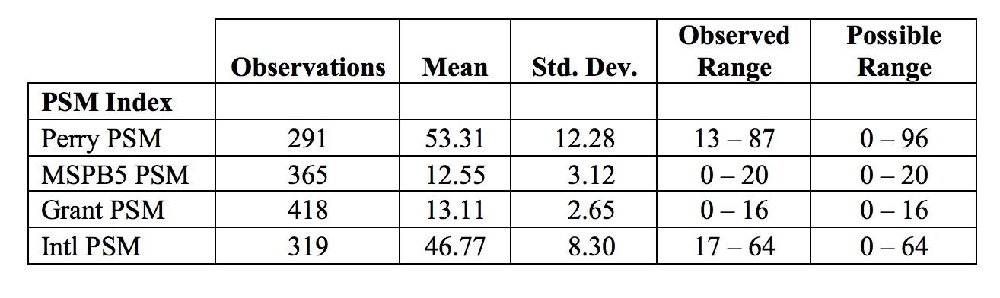
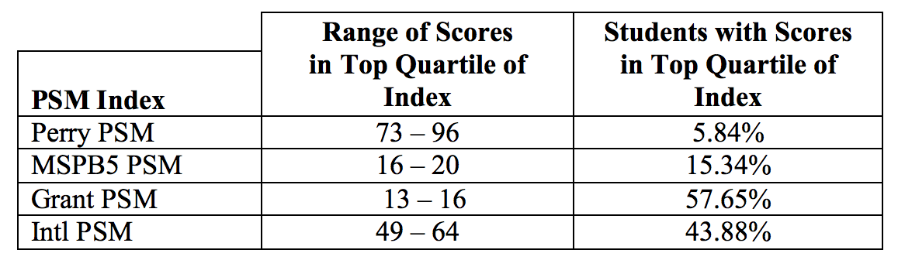
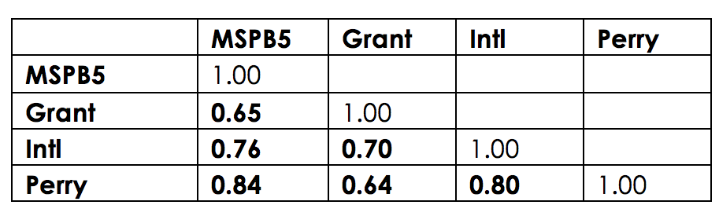

```{r load-libraries, message=FALSE, warning=FALSE}
library(rprojroot)
library(tidyverse)
library(broom)
library(forcats)
library(stringr)
library(pander)
library(ggridges)
library(viridis)

root <- find_rstudio_root_file()

psm <- read_csv(file.path(root, "data", "data_clean", "psm_clean.csv"))

theme_psm <- function(base_size = 11) {
  final_theme <- theme_minimal(base_family = "Roboto Condensed", 
                               base_size = base_size)
  final_theme
}
```

## Replicate original tables

Before doing fancier analysis and visualizations, I replicated the three summary tables that were originally created with SPSS.

### Table 1: Summary statistics

#### Original table

<div class="row">
<div class="col-sm-12 col-md-8 col-md-offset-2">



</div>
</div>

#### Table using current data

```{r psm-index-summary, results="asis"}
psm_indexes_long <- psm %>%
  select(ID, starts_with("index")) %>%
  gather(index, value, -ID) %>%
  filter(!str_detect(index, "_z")) %>%
  mutate(index = fct_inorder(index, ordered = TRUE),
         index = fct_recode(index,
                            Perry = "index_perry",
                            MSPB5 = "index_msp",
                            Grant = "index_grant",
                            International = "index_intl"))

psm_indexes_long_z <- psm %>%
  select(ID, starts_with("index")) %>%
  gather(index, value, -ID) %>%
  filter(str_detect(index, "_z")) %>%
  mutate(index = fct_inorder(index, ordered = TRUE),
         index = fct_recode(index,
                            Perry = "index_perry_z",
                            MSPB5 = "index_msp_z",
                            Grant = "index_grant_z",
                            International = "index_intl_z"))

psm_indexes_long %>%
  filter(!is.na(value)) %>%
  group_by(index) %>%
  summarize(Observations = n(),
            Mean = mean(value),
            `Std. Dev` = sd(value),
            Minimum = min(value),
            Maximum = max(value)) %>%
  rename(Index = index) %>%
  pandoc.table(justify = "lccccc")
```

*Uh oh, this doesn't match.* `r emo::ji("thinking")` 

The mean, min, and max are all off, but oddly enough, the N and standard deviations are both correct. 

### Table 2: High PSM

#### Original table

<div class="row">
<div class="col-sm-12 col-md-8 col-md-offset-2">



</div>
</div>

#### Table using current data

This is slightly tricky (and wrong) because the ranges of possible values don't match what's in the original Word file. The Perry index, for example, should range from 0–96, but in reality it goes up to a maximum of 111 (and I don't know what the actual real life maximum should be, given what it's calculating). The same issue appears in the other indexes. Grant should range from 0–16, but here it ranges from 0–20, so the top quartile is 15–20 instead of 13–16.

So for now this is wrong, but the code exists and everything can be made right once we figure out the issues with index calculation.

```{r index-quartiles, results="asis"}
possible_quantiles <- psm_indexes_long %>%
  distinct(index) %>%
  mutate(possible_min = c(0, 0, 0, 0),
         possible_max = c(116, 25, 20, 80)) %>%
  nest(-index) %>%
  mutate(quantiles = data %>% map(~ quantile(.$possible_min:.$possible_max))) %>%
  unnest(quantiles %>% map(tidy))

possible_quantiles_wide <- possible_quantiles %>% 
  mutate(names = fct_inorder(names)) %>% 
  spread(names, x) %>%
  mutate(`Top quartile range` = paste0(`75%`, "-", `100%`),
         `Possible range (wrong?)` = paste0(`0%`, "-", `100%`))

psm_index_quantiles <- psm_indexes_long %>%
  filter(!is.na(value)) %>%
  nest(-index) %>%
  mutate(temp = map2(
    .x = data, .y = index,
    ~ mutate(.x, quartile = cut(
      value,
      breaks = filter(possible_quantiles, index == .y) %>% pull(x),
      labels = FALSE, right = FALSE, include.lowest = TRUE
    ))
  )) %>%
  unnest(temp)

psm_index_quantiles %>%
  group_by(index, quartile) %>%
  summarize(n = n()) %>%
  mutate(perc = n / sum(n)) %>%
  ungroup() %>%
  filter(quartile == 4) %>%
  left_join(possible_quantiles_wide, by = "index") %>%
  mutate(perc = scales::percent(perc)) %>%
  select(Index = index, N = n, `Possible range (wrong?)`,
         `Top quartile range`, `Students in top quartile` = perc) %>%
  pandoc.table(justify = "lcccc", split.table = Inf)
```


### Table 3: PSM correlations

#### Original table

<div class="row">
<div class="col-sm-12 col-md-8 col-md-offset-2">



</div>
</div>

#### Table using current data

```{r index-correlations, fig.width=3, fig.height=3}
psm_cor <- psm_indexes_long %>%
  spread(index, value) %>% 
  select(-ID) %>% 
  cor(use = "na.or.complete")

psm_cor[upper.tri(psm_cor)] <- NA

psm_cor_long <- psm_cor %>%
  as.data.frame() %>%
  rownames_to_column() %>%
  as.tibble() %>%
  gather(var2, value, -rowname, na.rm = TRUE) %>%
  mutate(rowname = fct_inorder(rowname, ordered = TRUE),
         var2 = factor(var2, levels = levels(rowname), ordered=TRUE))

ggplot(psm_cor_long, aes(x = fct_rev(rowname), y = fct_rev(var2), fill = value)) +
  geom_tile() +
  geom_text(aes(label = round(value, 2)),
            family = "Roboto Condensed", fontface = "plain") +
  scale_fill_gradient(low = "white", high = "#eb6864", 
                      limit = c(floor(min(psm_cor_long$value) * 10) / 10, 0.999),
                      na.value = "grey95") +
  labs(x = NULL, y = NULL) +
  guides(fill = FALSE) +
  coord_equal() +
  theme_psm() +
  theme(panel.grid.major = element_blank())
```


## Check equality of distributions

### Raw index scores

```{r plot-raw-scores-ridge, fig.width=8, fig.height=2.5, warning=FALSE}
ggplot(psm_indexes_long, aes(x = value, y = fct_rev(index), fill = index)) + 
  geom_density_ridges2(aes(height = ..density..),
                       stat = "density", size = 0.25) +
  scale_fill_viridis(discrete = TRUE, option = "viridis") +
  guides(fill = FALSE) +
  labs(x = "Index score", y = NULL) +
  theme_psm() + 
  theme(panel.grid.major.y = element_blank())
```

### Standardized scores

```{r plot-std-scores-ridge, fig.width=8, fig.height=2.5, warning=FALSE}
ggplot(psm_indexes_long_z, aes(x = value, y = fct_rev(index), fill = index)) + 
  geom_density_ridges2(aes(height = ..density..),
                       stat = "density", size = 0.25) +
  scale_fill_viridis(discrete = TRUE, option = "viridis") +
  guides(fill = FALSE) +
  labs(x = "Standardized z-score", y = NULL) +
  theme_psm() + 
  theme(panel.grid.major.y = element_blank())
```

Or as a violin chart:

```{r plot-std-scores-violin, fig.width=8, fig.height=4, warning=FALSE}
set.seed(1234)
ggplot(psm_indexes_long_z, aes(x = index, y = value, fill = index)) +
  geom_violin() +
  geom_point(position = "jitter", size = 0.5, alpha = 0.2) +
  stat_summary(fun.y = "mean", colour = "#eb6864", size = 4, geom = "point") +
  scale_fill_viridis(discrete = TRUE, option = "viridis") + 
  guides(fill = FALSE) +
  labs(x = NULL, y = "Standardized z-score") +
  theme_psm() +
  theme(panel.grid.major.x = element_blank())
```
